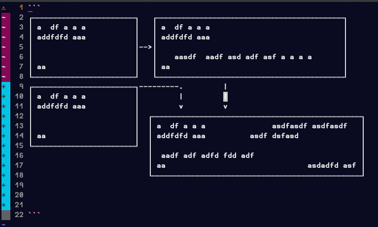

# boxcar
> boxes around text in vim !
### ! experimental and unstable
still very experimental and liable to have odd behaviors and [bugs](#bugs). please see
[CONTRIBUTING](CONTRIBUTING.md) if you would like to help improve this plugin.

a vim plugin to get configurable text boxes around text as you type

### usage
please forgive the lack of documentation anywhere. hopefully v0.1 will have
more explanation. in the meantime, the basic idea is to call `:BoxcarMake`
and then either resize the box with e.g. `:BoxcarResize 3 3 1` with your
cursor inside the box you desire to expand, or `:BoxcarOn` and then start
typing inside a box.

If you resize a box to your expeceted desired size, you can type inside of it
with 'Replace mode', by e.g. typing `R` in normal mode. Otherwise `BoxcarOn`
allows you to grow a box as large as you like as you type. current behavior is
not smart enough to handle multiline yet, so its a bit of a manual process, of
`BoxcarResize` and 'Replace mode'.

For now, the only way to get side-by-side boxes is with `<Ctrl-v><motions>y
....` and pasting the box where you would like.

### bugs
if you try to type with BoxcarOn in a box that is left of another box, you
  will be disappointed. please try resizing the left box with `BoxcarResize`,
  and then using Replace mode.
